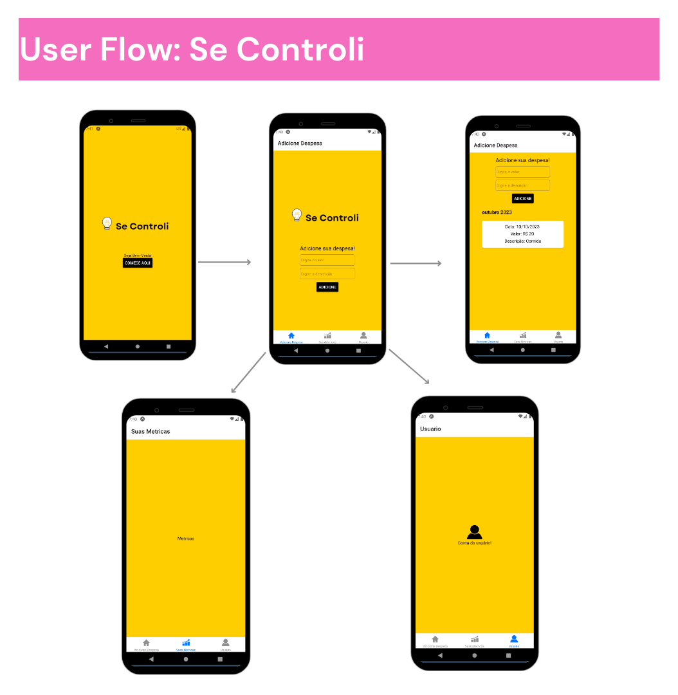
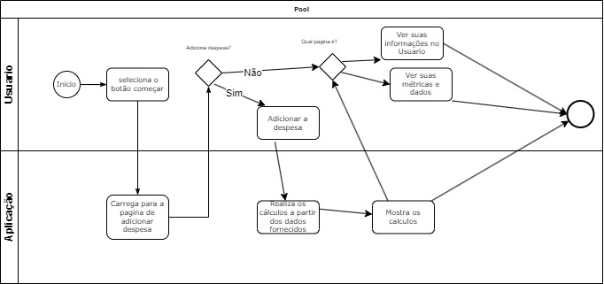
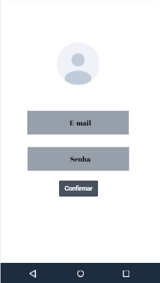
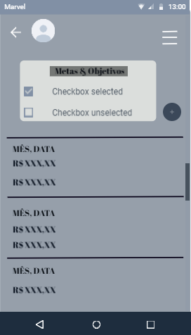

# Projeto de Interface

Abaixo estão as interfaces desenvolvidas pelo grupo. É importante ressaltar que essas interfaces podem passar por modificações à medida que o projeto evolui, mas representam a ideia inicial da aplicação.

O grupo pensou em desenvolver uma aplicação que fosse facilmente acessível a todos os usuários, com interfaces simples, porém eficazes.

## Diagrama de Fluxo

O fluxograma apresentado demonstra uma representação simplificada do processo a ser seguido refrente ao projeto em desenvolvimento.

##Wireframes

Abaixo estão os primeiros wireframes a serem criados pelo grupo.

